Build n Blend

Build n Blend is an idea for a themed coffee shop for coffee and lego builders. The idea is to bring together two hobbies that compliment each other! As we know having a good coffee machine and the price of lego is very expensive, so Build n Blend was imagined to allow enthusiasts to continue to experience what they love without having to spend a big upfront bill.

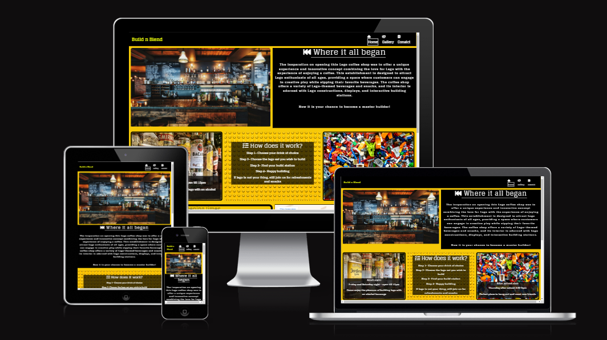

[View Build n Blend live project here](https://rhystyler112.github.io/User-Centric-Frontend-Development--Build-n-Blend//)
- - -
## Table of Contents

### [User Experience (UX)](#user-experience-ux-1)
* [User Stories](#user-stories)
### [Design](#design-1)
### [Features](#features)
* [Existing Features](#existing-features)
### [Features Left to Implement](#features-left-to-implement-1)
### [Technologies Used](#technologies-used-1)
### [Frameworks, Libraries & Programs Used](#frameworks-libraries--programs-used-1)
### [Testing](#testing-1)
* [Validation Results](#validation-results)
* [Manual Testing](#manual-testing)
* [Lighthouse Report](#lighthouse-report)
### [Deployment and local development](#deployment-and-local-development-1)
* [GitHub Pages](#github-pages)
* [Forking the GitHub Repository](#forking-the-github-repository)
* [Local Clone](#local-clone)
### [Credits](#credits-1)
### [Acknowledgements](#acknowledgements-1)
---

## User Experience (UX)

This website is meant to attract people who like drinking coffee and building a variety of lego sets.

There is clear navigation and a form set up on the contact page to request a specific lego set or hire the venue out for a function.

Users can see on our gallery page the setting of the shop with lego builds that customers have built with their time with us

### User Stories

 * First-time visitor goals
    * Understand the main purpose of the site and learn more about why Build n Blend was created.
    * Easily navigate throughout the site
    * Find the Contact form and fill it out.
 * Returning visitor goals
    * Find out information about the company and how the process works.
    * Locate contact information.
    * Review the site's extensive gallery.

 * Frequent user goals
    * Check if there are any new lego sets they can pre-book on contact form.
    * Review the gallery for any new photos.

- - -

## Design

 * Colour Scheme
    * Primary colours used on the website: 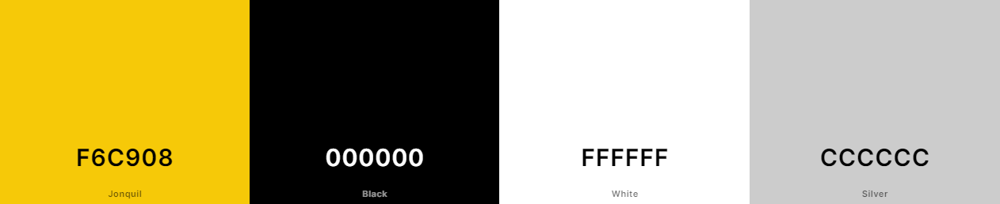

 * Typography
    * Glegoo font is the main font used throughout due to its similarity with the lego font, the site with sans-serif as its fallback font in case Glegoo doesn't import for some reason.

 * Wireframes
    * I used figma to create my wireframes which are located below
    
    

    

    
Mobile
    

    

    

    

    
Tabelt
    

    

    

    

    
Desktop
    

    
---

## Features

* This website is targeting people who want a relaxing environment to drink coffee and build lego.
* They can do that by order from our vast list of coffees and the variety of lego sets we have to offer
* Responsive on all device sizes.

### Existing Features

* Navigation bar
    * It is featured and fixed on all three pages and the thank-you page.
    * Includes links to the logo, home page, gallery and contact page
    * It is identical in design across the pages.
    * Allows easy navigation from page to page without having to revert back to the previous page via the "back" button.

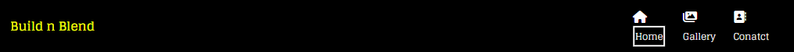

* Hero Image
    * It is composed of a image featuring the inside of the coffee shop.
    * Shows customer there first glimse of what there experice would like if they came to the shop

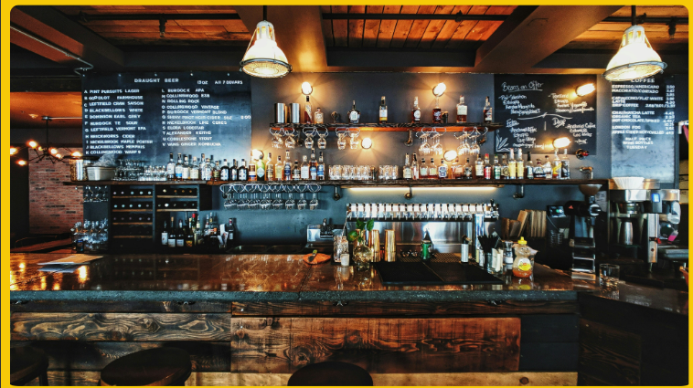

* Section one, 'Where it all began?'
    * It is composed of an image featuring the inside of the coffee shop.
    * Shows customer their first glimpse of what their experience would like if they came to the shop

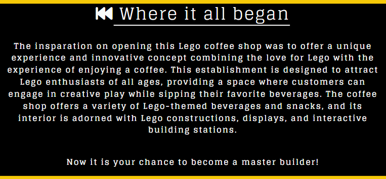

* Section two, 'How does it work?'
   * Information about the ordering and building process customers will experience in the store.

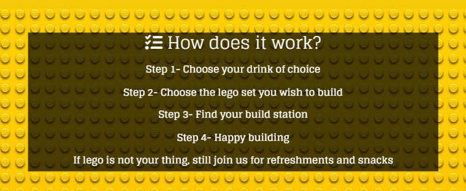

* Events
    * This section will allow users to get information about Build n Blends events during the week.
    * Have the address of the shop so customers can clearly see it in writing.
    * Also embedded is google maps of shop location so customers can see where the shop is.

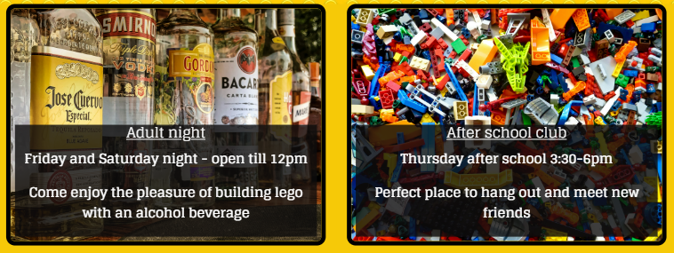

* Opening Times and Location
    * This section will allow users to see the opening hours for during the week.
    * Opportunity to experience a slightly different environment, depending on age.
    * For example on Saturday night you way when to have a beer or cocktail while you build.

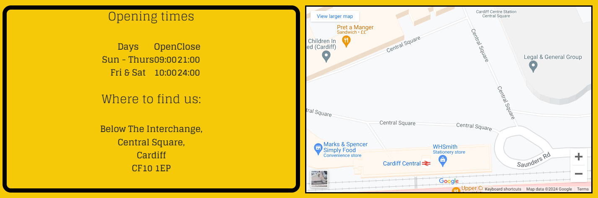

* Footer
    * Links to the social media for Build n Blend will open in a new tab to allow easy navigation for the user.
    * It is valuable to the user as it gives them an easy contact option via social media.
    * Hold copyright information about the author.

* Gallery 
    * The gallery will provide the user with supporting images to see lego build, coffee on offer and customers having a good time.
    * This section is valuable to the user as they will see our previous experiences of past customers.

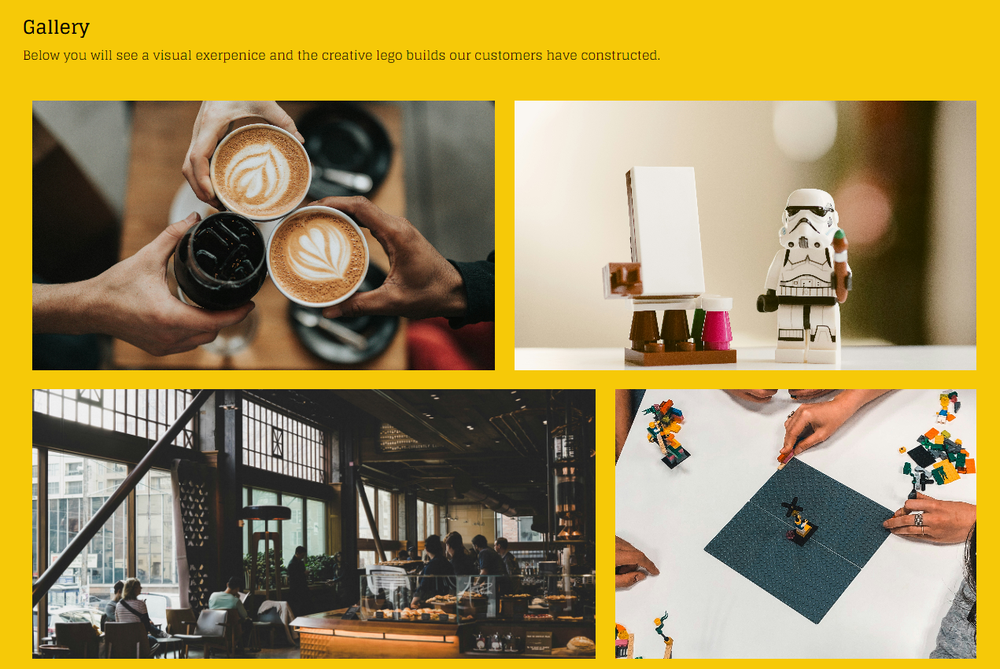

* Contact Page
    * This page will allow users to choose a lego set they wish to build, enquiries on booking the venue for a function, and all other questions.
    * In the future, there might be more options of lego sets for customers to choose from.

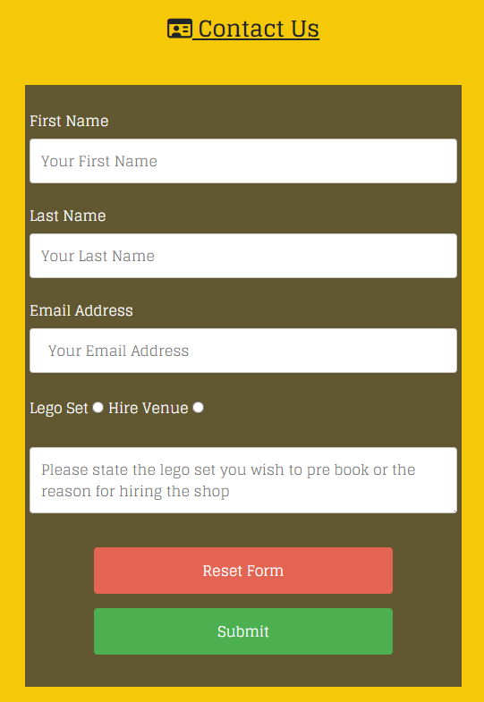

* Thank you message page
    * Confirms we have received the customer request

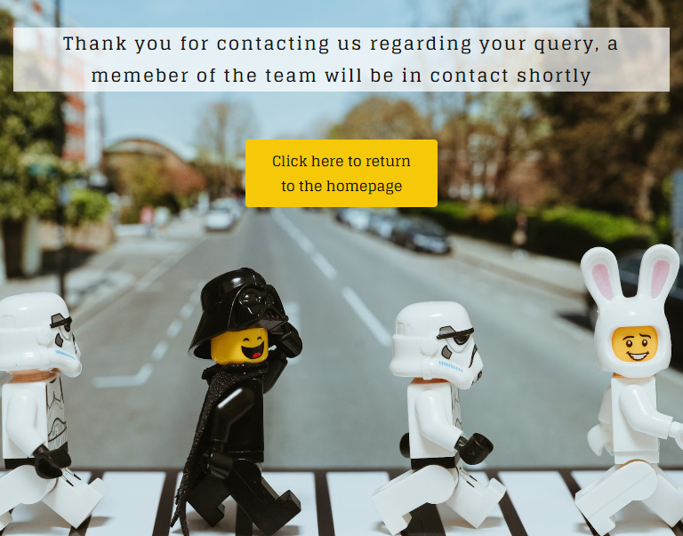

---

## Features Left to Implement

* Additional lego sets may be on offer and broken down between small, medium and large.
* Updated gallery with additional images.
* In the future, there could page dedicated to our menu and inventory of the lego set we offer

---

## Technologies Used

 * [HTML5](https://en.wikipedia.org/wiki/HTML5)
 * [CSS3](https://en.wikipedia.org/wiki/CSS)
 * [Bootstrap](https://getbootstrap.com/)

---

## Frameworks, Libraries & Programs Used

 * [Gitpod](https://www.gitpod.io/)
    * To write the code.
 * [Git](https://git-scm.com/)
    * for vesion control.
 * [Github](https://github.com/)
    * Deployment of the website and storing the files online.
 * [Google Fonts](https://fonts.google.com/)
    * Import main font the website.
* [Am I Responsive](https://ui.dev/amiresponsive)
    * Mockup picture for the README file.
 * [Font Awesome](https://fontawesome.com/)   
    * Import main font the website.
---

## Testing

The W3C Markup Validator and W3C CSS Validator services were used to validate every 

 * [W3C Markup Validator](https://validator.w3.org/)
 * [W3C CSS Validator](https://jigsaw.w3.org/css-validator/)

### Validation results

index.html

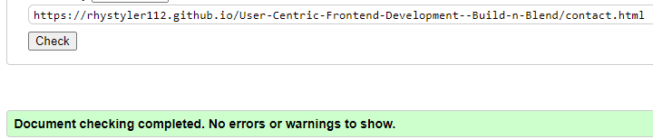

gallery.html

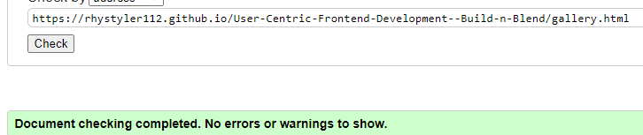

contact.html

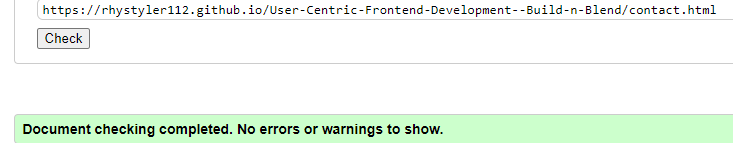

thak-you.htmml

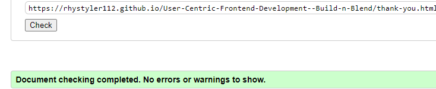

style.css

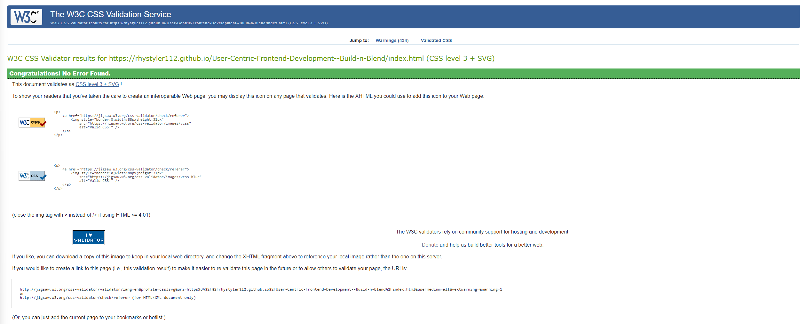

### Manual Testing

* The website was tested on Google Chrome, Microsoft Edge, and Opera browsers.
* The website was viewed on a desktop computer, tablet, and iphone 13.
* A large amount of testing was done to ensure links between pages are working correctly on all pages.
* Family and friends were asked to review the website for a better understanding of the user experience.
* Dev Tools was used to test how the site looks on various screen sizes.

### Bugs and Fixes

*   Could not get background images through CSS to show once after being pushed and live on gitpages, fixed this by using correct path to image.
*   No know bugs

### Lighthouse Report

#### Mobile analysis

Home Page

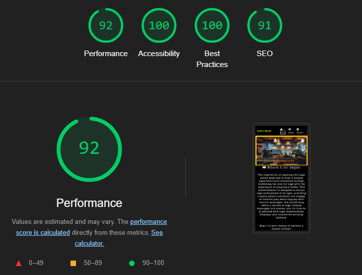

Gallery

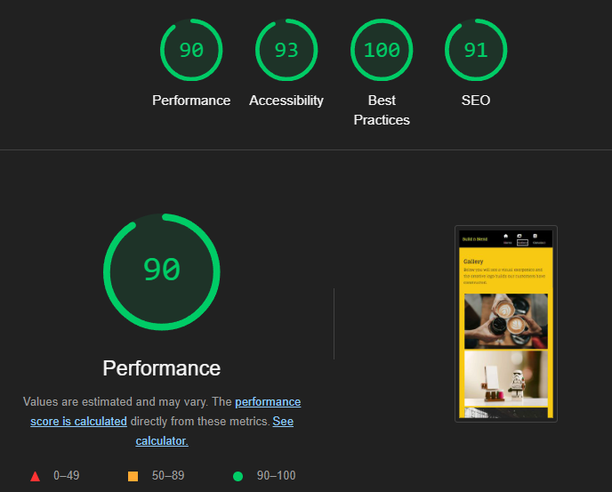

Sign Up

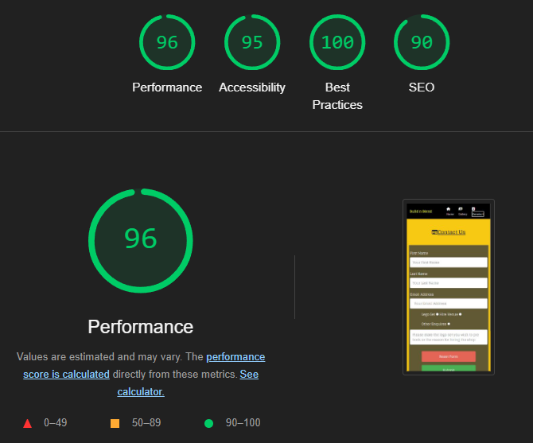

Application Received

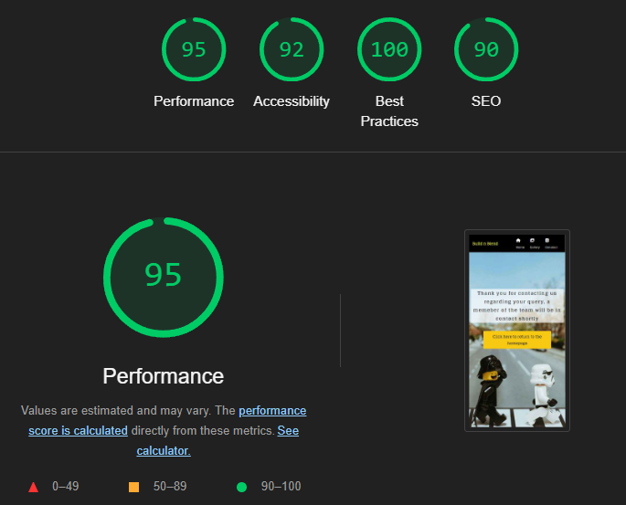

#### Desktop analysis

Home Page

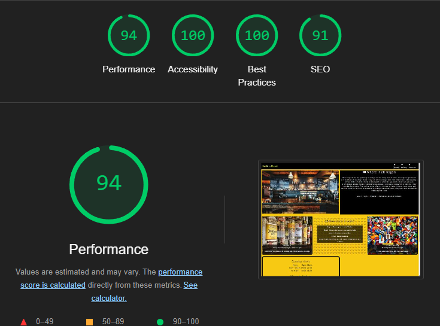

Gallery

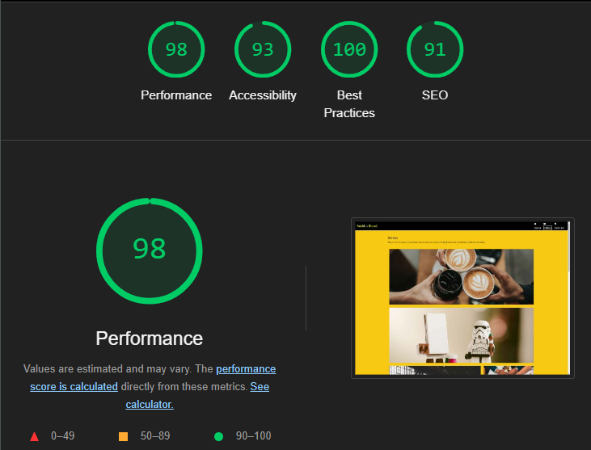

Sign Up

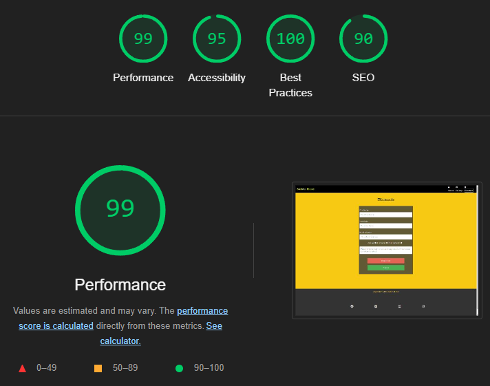

Application Received

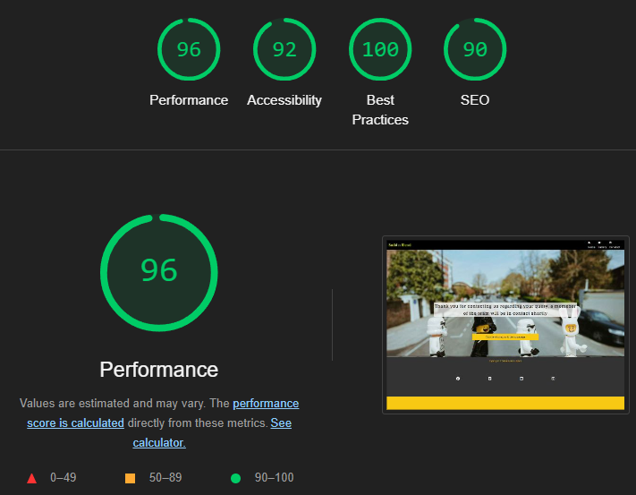

---

## Deployment and local development

### GitHub Pages

GitHub Pages used to deploy live version of the website.
1. Log in to GitHub and locate [GitHub Repository Lunar Escape](https://github.com/RhysTyler112/User-Centric-Frontend-Development--Build-n-Blend)
2. At the top of the Repository(not the main navigation) locate "Settings" button on the menu.
3. Scroll down the Settings page until you locate "GitHub Pages".
4. Under "Source", click the dropdown menu "None" and select "Main" and click "Save".
5. The page will automatically refresh.
6. Scroll back to locate the now-published site [link](https://rhystyler112.github.io/User-Centric-Frontend-Development--Build-n-Blend/index.html) in the "GitHub Pages" section.

### Forking the GitHub Repository

By forking the repository, we make a copy of the original repository on our GitHub account to view and change without affecting the original repository by using these steps:

1. Log in to GitHub and locate [GitHub Repository Lunar Escape](https://github.com/RhysTyler112/User-Centric-Frontend-Development--Build-n-Blend)
2. At the top of the Repository(under the main navigation) locate "Fork" button.
3. Now you should have a copy of the original repository in your GitHub account.

### Local Clone

1. Log in to GitHub and locate [GitHub Repository Lunar Escape](https://github.com/RhysTyler112/User-Centric-Frontend-Development--Build-n-Blend)
2. Under the repository name click "Clone or download"
3. Click on the code button, select clone with HTTPS, SSH or GitHub CLI and copy the link shown.
4. Open Git Bash
5. Change the current working directory to the location where you want the cloned directory to be made.
6. Type `git clone` and then paste The URL copied in the step 3.
7. Press Enter and your local clone will be created.

---

## Credits

### Code
 * [CSS-tricks](https://css-tricks.com/) gave me the understanding the around flexbox.
 * [w3schools](https://www.w3schools.com/) CSS section gave inspiration to the design of the website.
 * The README template was helpfully provided by [Code Institute (template)](https://github.com/Code-Institute-Solutions/SampleREADME)
 * To help make sure I was committing and pushing my work correctly using [Git Cheat Code](https://education.github.com/git-cheat-sheet-education.pdf
 )

### Content

 * All content was written by the developer.
 * [Color contrast checker](https://coolors.co/contrast-checker/112a46-acc8e5) was used to decide which colors would be used for the website.

### Media 

 * [Unsplash](https://unsplash.com/) free stock photos, royalty free images.
 * [Imageresizer](https://imageresizer.com//) Resizing images.
---

## Acknowledgements

 * My mentor Mitko Bachvarov provided helpful feedback and a link to the Flexbox guide.
 * Slack community for encouragement and information.